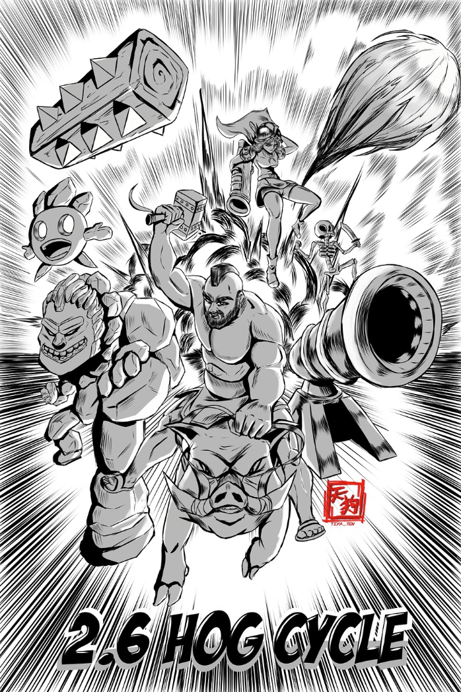

# clash-royale-card-tracker
CNN (MobileNet) & OpenCV based opponent card tracker for clash royale


hard thumbnail by @teka._.ten instagram

## Why does this exist?

If you've ever lost a game of Clash Royale because you got outcycled by an opponent, or at a critical moment you placed your win condition and they had the perfect card to counter it on the right time, this cycle tracker is for you!

Instead of getting gud, just plug and play this application to a BlueStacks Clash Royale emulator and get infinite LP lol

## Important Disclaimer

This card tracker only detects Hog 2.6 at the moment ! Clash Royale has 100 deployable troop cards, assuming 200 images per troop class to allow the CNN to learn how the card looks when placed, this would mean I would have to collect 20,000 images by hand. I am not doing allat rn

**Current Accuracy:** ~60-70% (6 card classes)

## Installation

### Prerequisites
- Python 3.8+
- NVIDIA GPU (optional but recommended for training)
- CUDA 12.8+ (if using GPU)


## Usage

### 1. Train the Model

Trains a MobileNetV2 classifier on collected troop images.
```bash
python train.py
```

**What it does:**
- Loads images from `data/train/` and `data/val/`
- Trains for 25 epochs
- Saves best model to `models/best_model_TIMESTAMP.pth`
- Generates training curves plot


### 2. Run Real-time Detection

Detects troop deployments in real-time from screen capture.
```bash
# With trained model (classification enabled)
python detector.py --model models/best_model_20250107_123456.pth

# Without model (clock detection only)
python detector.py

# Select game window interactively
python detector.py --model models/best_model_*.pth --select-region

# Disable saving detections
python detector.py --model models/best_model_*.pth --no-save
```


## Dataset Collection Notes

### Current Image Requirements

**Per card class:** 100 images total
- **Training:** 56 gold + 24 normal (80 total)
- **Validation:** 14 gold + 6 normal (20 total)

**Timing:** Screenshot during **drop animation** (0.1-0.3s after deployment)
- Troop is elongated/stretched
- Clock is visible but mostly white with small red
- Troop is centered and clearly visible

**Folder structure:**
```
data/train/cannon/
  ├── gold/      # Gold cosmetic troops (56 images)
  └── normal/    # Normal color troops (24 images)
```

## Next Steps

### Short-term Improvements

1. **Switch to ResNet18** (better accuracy)
```python
   # In train.py, replace MobileNetV2:
   model = models.resnet18(pretrained=True)
   # Freeze early layers, train final layers
```
   **Expected gain:** +5-10% accuracy

2. **Collect More Data**
   - Target: 200 images per class
   - Focus on gold cosmetics (more common in practice)
   - **Expected gain:** +10-15% accuracy

3. **Optimize Transforms**
```python
   # Try direct resize (no random crop) for centered troops:
   transforms.Resize(224)  # Instead of Resize(256) + RandomCrop(224)
```

4. **Fine-tune Hyperparameters**
   - Increase epochs: 40 instead of 25
   - Try AdamW optimizer with weight decay
   - Experiment with learning rate schedules

### Future Features

- **Fireball/Log Detection** - Separate CV pipeline (orange/brown detection)
- **Card Cycle Counter** - Track when specific card returns to hand (4 placements)
- **Evolution/Hero Variants** - Expand to handle special card variants

### Known Limitations

- **Not viable for elixir tracking** (requires 100% accuracy, CNN can't guarantee this)
- **Fast troops** (skeletons, ice spirit) may move out of detection region quickly
- **Overlapping deployments** can cause missed classifications

---

## Technical Details

### Model Architecture
- **Backbone:** MobileNetV2 (pretrained on ImageNet)
- **Frozen:** Feature extraction layers
- **Trainable:** Final classification layer (6 classes)
- **Input:** 224×224 RGB images
- **Output:** 6-class softmax probabilities